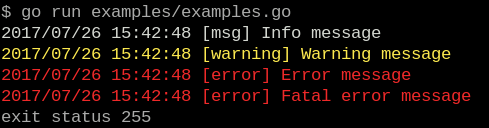

# nuveo/log
[](https://travis-ci.org/nuveo/log)
A simple to use log system, minimalist but with features for debugging and differentiation of messages


## Example

[](examples/example.go)


```go
package main

import (
    "fmt"
    "github.com/nuveo/log"
)

func main() {
    log.Debugln("Debug message")

    log.DebugMode = false
    log.Debugln("Debug message that will be hidden")

    log.Println("Info message")
    log.Warningln("Warning message")
    log.Errorln("Error message")
    log.Fatal("Fatal error message")
    fmt.Println("I will never be printed because of Fatal()")
}
```
